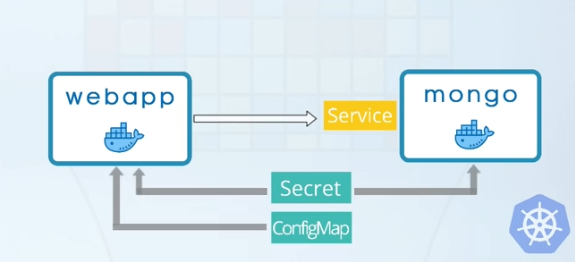

# Introduction
This project is based on following tutorial [Kubernetes Crash Course for Absolute Beginners [NEW]](https://www.youtube.com/watch?v=s_o8dwzRlu4). It was modified to address the issues I faced when using Windows. Please support the original creator of the tutorial.

# Starting the cluster
The scripts in this project were running on a 64-bit Windows 11 machine, using version `v1.29.0`. You will need to download the following software on your machine:
- minikube (from kubernetes website)
- docker desktop (18.09 or higher. From docker website)

All commands were executed in PowerShell. If you would like to check the version on your machine, use the following command:
```
minikube version
```

The default settings required 4 GB of memory to initialise the session. The tutorial only needed 2 GB of memory, therefore the memory requirements were explicitly stated. The default cpu settings aligned with what was mentioned in the tutorial, but they were stated anyways. The minikube session uses docker containers by default, but the `--driver` flag was added to show how the container configuration can be modified. To start the session, use the following command:
```
minikube start --driver docker --memory 2000 --cpus 2
```

If this is your first minikube session, then the deafult name of your session will be `minikube`. If you would like to specify the profile name of your minikube session, then you can do so by stating the name after the `-p` flag, e.g. `-p anotherSession`.

You can list all of the available profiles by using the following command:
```
minikube profile list
```

To check if the minikube session is running:
```
minikube status
```

The output of the command above should match the following output:
```
type: Control Plane
host: Stopped
kubelet: Stopped
apiserver: Stopped
kubeconfig: Stopped
```

The tutorial will be completed with the aid of kubernetes-cli (kubectl), which is automatically downloaded when installing minikube. Kubernetes CLI (kubectl) is used to configure the minikube cluster, whereas the minikube CLI is used to start up, shut down and deleting the cluster.

# Configuring the cluster
To check the status of all of the available nodes:
```
kubectl get node
```
Each node can contain multiple pods.

This tutorial will run 2 pods:
- webapp container (from webapp.yaml)
- mongodb container (from mongo.yaml)

The webapp and the mongo database containers will be configured in the following arrangement:


This project contains 6 shell scripts and YAML files:
- decodebase64.ps1 (not used)
    - Can be used to decode a base64 string.
    - Just run the script and enter your input.
    - This file is not even used in this tutorial.
- encodebase64.ps1
    - This file was used to create the username and password strings in the mongo-secret.yaml file.
    - This file is helpful, but not important. The tutorial can be completed without this file.
- mongo-config.yaml
    - Contains the name of the service which allows the web app container to communicate with the mongoDB database container. A service provides a stateful ip address and acts as a load balancer as well.
    - This file only contains non-confidential variables.
- mongo-secret.yaml
    - Contains the credentials (username and password), which allow deployments (web app and mongoDB database) to authenticate.
    - Should only contain confidential variables (e.g., usernames, passwords, certificates).
    - The variables should be base 64 encoded. This does not provide security.
    - Contains confidential information and should be encrypted using third party tools. This does provide security.
    - Ideally, it should not even be publicly available. It is publicly available here for demo purposes.
- mongo.yaml
    - Deployment and service file. Contains the blueprint for the database.
    - Should reference a volume (external storage), so if this pod dies, then the data remains persistent / backed up.
    - Should be stateful (`kind: StatefulSet`) as well. In this tutorial it is not because stateful sets are harder to configure.
    - A stateful deployment will allow coordination between read/write operations, along with preventing inconsistencies across pods.
- webapp.yaml
    - Deployment and service file. Contains the blueprint for the web application.
    - This web app can be accessed within the internal network only because it is not available externally.

The deployment files also contain variables that specify the upper limits to the resources that each pod should use. Those variables were commented out, but it is good practice to include them. Please watch the tutorial video and read the comments (in YAML files) to gain a better understanding of values within the YAML files.

Check that none of the components are running:
```
kubectl get pod
```

Before starting the deployments, the ConfigMap and Secret must exist. To do this:
```
kubectl apply -f /path/to/file/mongo-config.yaml
kubectl apply -f /path/to/file/mongo-secret.yaml
```

Then, the database pod should be created because the web app depends on the database.
```
kubectl apply -f /path/to/file/mongo.yaml
```

Finally, the web app should be started.
```
kubectl apply -f /path/to/file/webapp.yaml
```

The deployment and service should be created when each of the database and web app are started.

Check if all of the components were started successfully. All of the pods should be running.
```
kubectl get all
```

The config map and secret will not be shown when the command above is executed. To check the config map, replace `all` with `configmap`. To check the if the secret file started correctly, replace `all` with `secret`.

These are some helpful commands. These commands do not need to be executed to complete the tutorial, but they will be helpful to execute in the event that something did not start correctly.
```
# To check the service (check get all to get names of services)
kubectl describe service <name of service>
```
```
# To check the pod (check get all to get names of pods)
kubectl describe pod <name of pod>
```
```
# To check the logs for the pods
kubectl logs <name of pod>
```

To check if the web app is accessible via the browser, an ip address and the port for the web app are needed. To get the port number for the web app service:
```
kubectl get svc
```

To get the ip address:
```
minikube ip
```

Then to access the web service, enter the ip address and the port number in the following format in the browser.
```
<ip address>:<port number>
```
For example
```
192.168.49.2:30000
```

If that did not allow you to access the web app service, then you can try the following command to access the web app service via the browser
```
 minikube service webapp-service --url
```

The output of the command shown above should be pasted in the browser. You should be able to see a simple webpage with a picture of a dog and a simple form.

# Stopping the cluster
To stop the minikube cluster:
```
minikube stop
```

Add the `-p` flag and the cluster profile name to shut down a specific cluster.

# Deleting the cluster
To delete the minikube cluster:
```
minikube delete
```
Again, add the `-p` flag and the cluster profile name to delete a specific cluster.